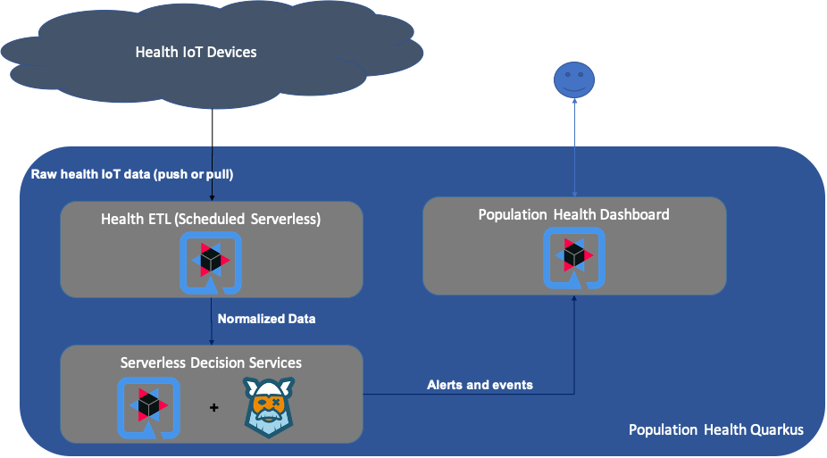

## IoT Population Health With Quarkus

*  [Introduction](#Introduction)
*  [Architecture](#Architecture)
*  [Running locally](#running-locally)
    *  [Decision Services](#decision-services)
    *  [Population Health Dashboard](#dashboard)
    *  [Health Data ETL](#health-data-etl)
    *  [Health Data Mock](#health-data-mock)
*  [Deploy Lambdas to AWS](#deploy-lambdas-to-aws)
*  [Data Format and Rules](#data-format-and-rules)
*  [Future Functionality and Next Steps](#future-functionality-and-next-steps)

### Introduction

This documentation provides an overview of the technical details and installation for the
IoT Population Health Quarkus implementation and submission for the the Quarkus Hackathon.

The objective of the architecture is to create an efficient, serverless, and rules driven architecture
that can be used to process health data telemetry from a wide array of devices and health data ecosystems and unify those diverse sources to allow for common processing and actions within a given population.

A rules driven approach  gives enterprises the ability to customize data processing
via decision tables (and in the future via business process management notation). Coupled with a serverless architecture allows for rapid deployment of new capability on Quarkus with little or no code changes..    

### Architecture

From a technical perspective the goal of the architecture is to create a set of services that allow an enterprise to process a diverse set of health data telemetry, evaluate that data in a highly customizable way (business rules and decision tables), and to take action and evaluate the data in a common environment. Quarkus enables those goals with out of the box serverless functionality and through integration with Kogito.  


The population health architecture is composed of three services.
*  Health Extract Transform and Load (ETL)
   * Processes raw IoT device data and normalizes for rules processing and API invocation in decision services
   * Can be run in serverless mode with scheduled (pull) or event driven invocation (push)
*  Serverless Decision Services
   * The decision services is a Quarkus and Kogito microservice that executes business rules against API invocation from Health ETL or other actors who meet the API contract.
   * Decision services can be run in a serverless mode. The default implementation takes advantage of the amazon-lambda-http Quarkus implementation to allow the function to execute based on event invocation
   * Baseline rules are built using Excel based decision tables for easy consumption from business users
*  Population Health Dashboard
   * The population health dashboard is a Quarkus microservice that exposes the results of rule invocation in the Serverless Decision Services
   * In the default implementation the dashboard process Rewards and Alert data and exposes endpoints to store both
   * The dashboard takes advantage of the Quarkus ability to host a static site and exposes html and javascript via that capbility using a bootstrap based dashboard




The principle technical innovation in the architecture is in serverless decision services. The ability to encode a decision table in a REST ready serverless image has tremendous power and is unique to Quarkus with the Kogito extension.  

### Running locally
The sections below provide the introductory commands to run the services for the Population Health application in a local development environment. Note that some services specify a different port than the default since we'll be running more than one service in many scenarios.

**Prerequisites**
- maven 3.6.3+
- java 11+

#### Decision Services

The decision services platform can be run in a local environment using the out of the box maven capability that ships with Quarkus.  Run:

`mvn clean compile quarkus:dev -Dquarkus.http.port=8081`

The service exposes an endpoint at `/healthRules` that will by default execute the Health Rewards and Health Alerts rule sets.

For example, once up and running to hit a rule in the Health Rewards ruleset:
```
curl -X POST "http://localhost:8081/healthRules" -H "accept: application/json" -H "Content-Type: application/json" -d "{\"steps\":18000}"
```

See the [Data Format and Rules](#data-format-and-rules) section for more examples and details on the default rulesets.

Decision services are also built to run in a serverless environment. See [Deploy Lambdas to AWS](#deploy-lambdas-to-aws) for details.

#### Dashboard

The Population Health Dashboard can be run locally using the out of the box capability provided by Quarkus:

`mvn clean compile quarkus:dev -Dquarkus.http.port=8082`

The site is available at http://localhost:8082 using the port configuration above. Site assets are served using the static asset hosting provided by Quarkus.

#### Health Data ETL

The default implementation for the Health Data ETL service requires a connection to Google Fit APIs to fetch data. There are a number of steps required to authorize and connect Google APIs for execution in a local environment. If you want a simple experience to test decision services go to [Health Data Mock](#health-data-mock)

The following steps all require a Google account and access to, or the ability to enable, a Google Cloud account.

**Setup a Client**
1. Visit cloud.google.com
2. Login and access the console
3. In the left nav select APIs & Services
4. Select Credentials
5. At the top select `Create Credentials` button
6. Select OAuth client ID
7. In Application type select `Web application`
8. Enter a name for your app
9. Under `Authorized redirect URIs` enter the URL where you intend to run your health data service plus `/oauth2callback`. If running locally enter `http://localhost:8080/oauth2callback`
    * If running deployed as a function in AWS then see the [Deploy to AWS](#deploy-lambdas-to-aws) section below
10. **Hit Save**
11. Click on the row containing the client you just created in the steps above
12. Click `DOWNLOAD JSON` at the top of the screen
13. Save the file to a location of your choice (you'll need this path later)

**Configure the Application**
1. Open the `application.properties` file in `src/main/resources/application.properties`
2. Set the following required properties:
  * `google.fit.client.json.path` -- to the location of the `client_secret.json` file downloaded in the Setup a Client section above. Note: this file contains sensitive infromation. **Don't check it in to git**.
  * `google.fit.api.token.store` -- an available folder location to store the refresh token for fit api calls. Note: this token store is sensitive information. **Don't check it in to git**.
  * You'll also need to set the configuration for the location of decision services for the rest-client using this property `org.pophealth.client.HealthDataService/mp-rest/url=` That property can be set to the local URL or the URL of the lambda running in AWS.


**Run the Health Data ETL**

Once configured as above the Health Data ETL service can be run using the provided quarkus maven invocation:

`mvn clean compile quarkus:dev`

Then visit <http://localhost:8080/fitAuth>. If you haven't already authenticated then you'll be redirected to Google to allow your app access to your Google Fit data. Once authenticated the app will automatically process current data based on your provided configuration.

The Health Data ETL service can also be run as a simulated lambda in native or jvm mode. See the [Quarkus Amazon Lambda Guide](https://quarkus.io/guides/amazon-lambda-http) for instructions on running the simulated lambda.

### Deploy Lambdas to AWS

The decision services lambda can be deployed using the Quarkus guide out of the box [Quarkus Amazon Lambda Guide](https://quarkus.io/guides/amazon-lambda-http). If you have trouble with the Amazon steps check at that link starting with Build and Deploy.

The endpoint for the deployed decision services is `/healthRules`
#### Health Data Mock

The Health Data Mock is a Quarkus microservice that can be configured to invoke the decision services using mock data driven from a spreadsheet. It invokes the same APIs as the Health ETL service and can be used to test rules.

The mock data can be customized in `src/main/resources/mock` in the provided CSV

### Data Format and Rules

The business rules deployed as part of serverless decision services are all defined in Excel decision tables to allow for ease of access to business users. The baseline decision tables can be found in `src/main/resources` inside the decision-services Quarkus project.

  For the PoC the normalized input data is a flat object representing data points or lists of data points from the Health IoT device(s). In the future this API and backing data model object will need be made significantly more robust to support better data inputs. See the `HealthData.java` object in the decision services for the normalized format.


### Future Functionality and Next Steps

- Refactor connectors to external services (like Google Fit) to Quarkus extensions
- Dashboard UX
- Authentication and security on data services
- Enhanced data input and data structures for the decision services API

### Additional Resources
https://www.whoop.com/thelocker/respiratory-rate-tracking-coronavirus/
https://www.golfchannel.com/news/whoop-strap-key-detecting-nick-watneys-positive-test
